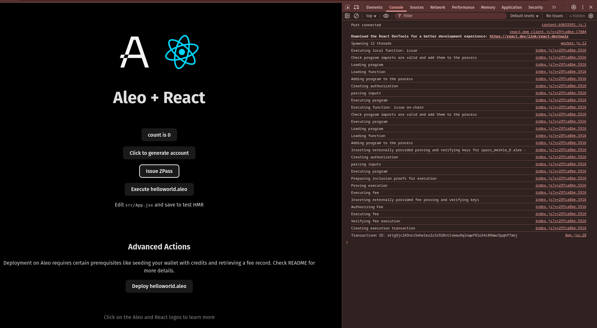

# ZPass Integration

## Create React Leo App:
- Command:
    ```sh
    npm create leo-app@latest
    ```
    
    <details><summary> Detailed Output </summary><blockquote>

    ~~~sh
    > npx
    > create-leo-app

    ✔ Project name: … gcyadav_leo_zpass_integration
    ✔ Select a framework: › React
    ✔ Select a variant: › JavaScript + Leo

    Done. Now run:

    cd gcyadav_leo_zpass_integration
    npm install
    npm run dev
    ~~~

    </blockquote></details>

- Install Dependencies:
    ```sh
    npm i zpass-sdk vite-plugin-wasm
    ```

## Start Project:
- Command:
    ```sh
    npm run dev
    ```
- Then, visit [http://localhost:5173](http://localhost:5173).

    

- Click in `Issue ZPass` Button:
    


- Here, in my case Transaction ID: `at1g9jc243nrs5ehelez2z3z928ntlvmau9qlnqwf9lu54z89dwz5pqhf7akj`

# Signature:
## Sign with `Transaction ID`:
- For me, program deployed Transaction ID is: `at1g9jc243nrs5ehelez2z3z928ntlvmau9qlnqwf9lu54z89dwz5pqhf7akj`. Command:
    ```sh
    leo account sign -d --private-key <redacted> --message "at1g9jc243nrs5ehelez2z3z928ntlvmau9qlnqwf9lu54z89dwz5pqhf7akj" --raw
    ```
- Output:
    ```sh
    sign1r4ltnhq8qfzdyhqy9w00ttwz22r8mv6mm8rwxt7wzdtz9rpy4vq0k34u3w5gd2hly6zwa2ga3vgzl86w5scyhgc9gsuh45ncequzwqrlc397gmr5mrjksfmaqwadgrxa2my23un2zj2ad2yvlh8f97a9qpmh7z2ycgkfzyf9smlq7kafv7wg8pqavp59fmxzqe2hrct9w0kqvq24lft
    ```