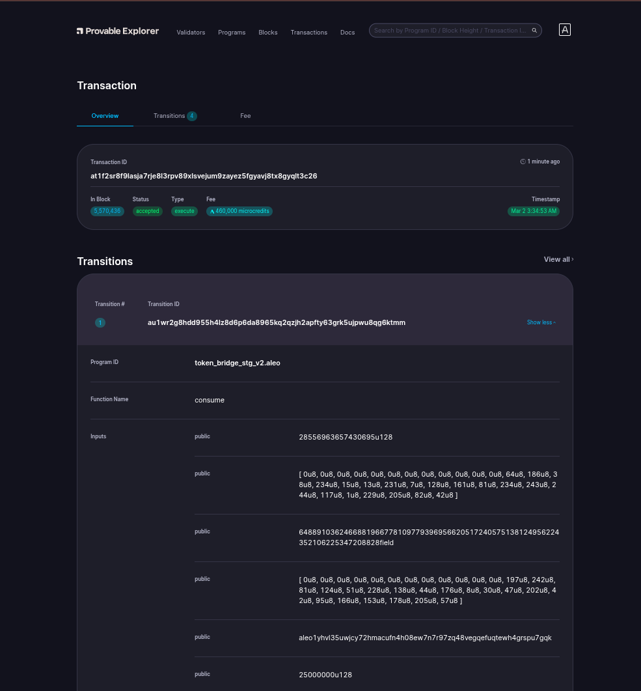

# Bridging On Aleo

- Transaction ID: `at1f2sr8f9lasja7rje8l3rpv89xlsvejum9zayez5fgyavj8tx8gyqlt3c26`.
  
    

- Here, I transferred 25USDC from ETH Sepolia Network to ALEO Test Network.

# Signature:
## Sign with `Transaction ID`:
- For me, program deployed Transaction ID is: `at1f2sr8f9lasja7rje8l3rpv89xlsvejum9zayez5fgyavj8tx8gyqlt3c26`. Command:
    ```sh
    leo account sign -d --private-key <redacted> --message "at1f2sr8f9lasja7rje8l3rpv89xlsvejum9zayez5fgyavj8tx8gyqlt3c26" --raw
    ```
- Output:
    ```sh
    sign1vkargy09u8d9fa84auguejcevkatwaesnjj2cr6ea226tzzjlsqupq5dfvuyyrsmxm8u6wvhgjdz7ekmsuschhv09ap9d6updu8wqqmlc397gmr5mrjksfmaqwadgrxa2my23un2zj2ad2yvlh8f97a9qpmh7z2ycgkfzyf9smlq7kafv7wg8pqavp59fmxzqe2hrct9w0kqvqz6pr3
    ```